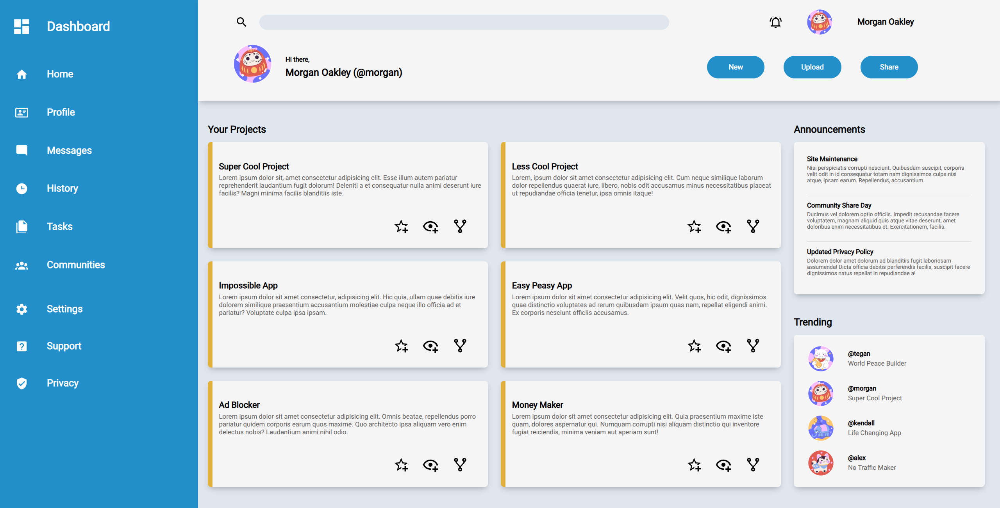

# Odin-Admin-Dashboard

An example user admin dashboard designed primarily using Grid Layout and built for the _[The Odin Project](https://www.theodinproject.com/about)_

## Example

## References
- <a href="https://www.flaticon.com/free-stickers/luck" title="luck stickers">Luck stickers created by Stickers - Flaticon</a>
    
- <a href="https://www.flaticon.com/free-stickers/amulet" title="amulet stickers">Amulet stickers created by Stickers - Flaticon</a>

- <a href="https://www.flaticon.com/free-stickers/japanese" title="japanese stickers">Japanese stickers created by Stickers - Flaticon</a>

## Inspiration
The _[Project: Admin Dashboard](https://www.theodinproject.com/lessons/node-path-intermediate-html-and-css-admin-dashboard) (Intermediate HTML & CSS)_ is part of _[The Odin Project: Full Stack Javascript](https://www.theodinproject.com/paths/full-stack-javascript)_ Curriculum